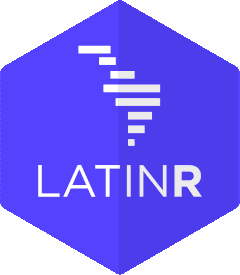
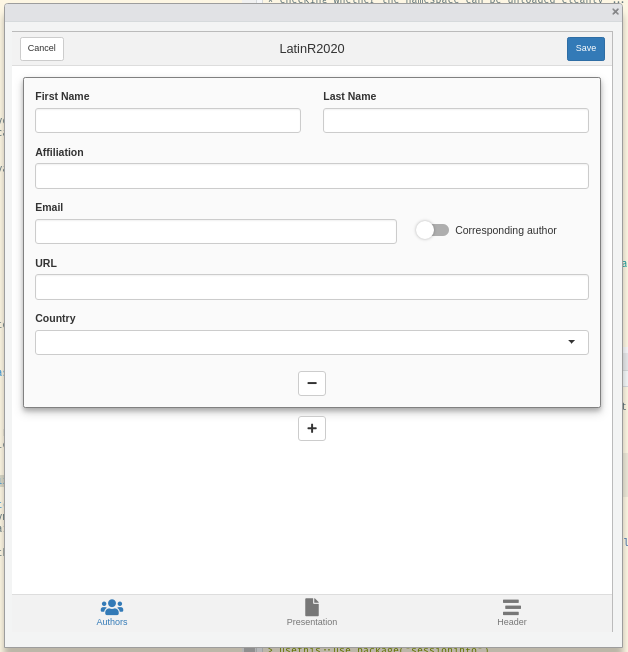

<!-- README.md is generated from README.Rmd. Please edit that file -->

```{r, include = FALSE}
knitr::opts_chunk$set(
  collapse = TRUE,
  comment = "#>",
  fig.path = "man/figures/README-",
  out.width = "100%"
)
```
# latinr 

<!-- badges: start -->
<!-- badges: end -->

latinr is a package that streamlines the submission process to the  [LatinR](http://latin-r.com/) conference. 

## Installation

You can install latinr from [GitHub](https://github.com/) with:

``` r
# install.packages("devtools")
devtools::install_github("latinr/latinr")
```

Optionally, latinr can use the keyring package to safely store your credentials. In unix-based platforms, you might need to install `libsodium` manually. You can do this by typing one of the following commands in your terminal:

* `sudo apt install libsodium-dev` in Debian, Ubuntu, and derivatives. 

* `yum install libsodium-devel` in  Fedora, EPEL. 

* `brew install libsodium` in OSX.

And then:
```r
install.packages("keyring")
```

## Usage

If you are going to submit an article to LatinR, you will need to create an user at `r latinr:::.latinr_url("latinr")`. Then, use

```r
latinr:::latinr_password_set()
```

to save your credentials in your machine. 

To start writing your submission, in RStudio, go to File -> New File -> R Markdown -> From Template and choose "LatinR submission article". This will give you an example article that uses the correct template and has the important metadata. 

Alternatively, you can use the UI wizard with `latinr::latinr_wizard()`. It will open up a shiny interface to help you populate your submission and then save the result into a file. 




When you finish writing your article, use `latinr::latinr_submit()`. By default, it will check that the metadata is in order, will render your rmarkdown file with anonymisation and upload it to the confference. If everything was in order, you will receive an email. 

As a last step, check that your submission is in the website with the correct information. 

